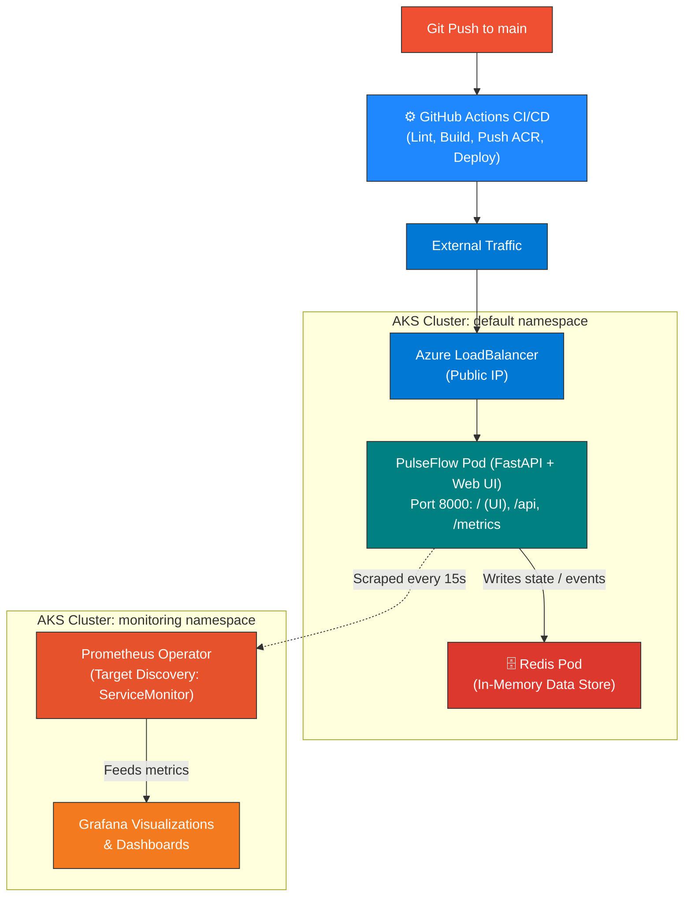

# PulseFlow Telemetry API

A containerized telemetry ingestion service running on Azure Kubernetes Service (AKS), automated with Terraform and monitored via the Prometheus Operator and Grafana.

## Architecture

The service exposes an HTTP endpoint backed by an internal Redis cache. Cloud infrastructure is provisioned through Terraform, with Kubernetes handling pod scheduling and service exposure via an Azure Load Balancer.



## Key Implementation Details

* **Automated CI/CD Pipeline (GitHub Actions):** Every commit pushed to `main` triggers automated linting, container builds pushed to Azure Container Registry (ACR) via short-lived credentials, and rolling zero-downtime updates directly to the AKS cluster.

* **Interactive Frontend UI:** The FastAPI application serves a web interface that allows users to trigger real-time telemetry events and interactively visualize Redis state updates directly from the browser.

* **Passwordless Cluster Security (Azure Managed Identity):** AKS node pools authenticate with ACR using the cluster’s managed Kubelet identity assigned to the Azure `AcrPull` role. No static container registry passwords or `imagePullSecrets` are stored in Kubernetes manifests.

* **Declarative Scrape Targets:** Observability is driven by `kube-prometheus-stack`. Scraping is managed dynamically through a Kubernetes `ServiceMonitor` CRD that automatically discovers application pods across namespaces.

* **Workload Isolation & Resource Bounds:** All deployments define explicit CPU/memory requests and limits to guarantee predictable pod scheduling and eliminate noisy-neighbor issues.

* **Infrastructure as Code (IaC):** Core cloud resources—Resource Group, Virtual Network, Subnets, AKS cluster, and ACR—are fully declared and managed via modular Terraform configurations.

## Tech Stack

* **Cloud:** Microsoft Azure (AKS, Azure Container Registry, Virtual Networks, Managed Identity)

* **CI/CD:** GitHub Actions

* **Infrastructure as Code:** Terraform

* **Container & Orchestration:** Docker, Kubernetes (Deployments, Services, ServiceMonitors)

* **Application & Web:** Python 3.11, FastAPI, HTML/Tailwind CSS frontend, Redis

* **Observability:** Prometheus Operator, Grafana, Helm (`kube-prometheus-stack`)

## Project Structure

```text
├── .github/
│   └── workflows/
│       └── deploy.yaml             # GitHub Actions CI/CD pipeline
├── terraform/                      # Azure infrastructure manifests
│   ├── main.tf                     # AKS, ACR, and networking configuration
│   ├── variables.tf                # Cluster parameters and resource sizing
│   └── outputs.tf                  # Control plane endpoints and identity details
├── k8s/                            # Kubernetes manifests
│   ├── pulseflow-deployment.yaml   # Workload definition & LoadBalancer service
│   ├── redis-deployment.yaml       # Internal Redis service
│   └── pulseflow-servicemonitor.yaml # Prometheus Operator scrape target
├── app/                            # Application & Frontend source
│   ├── main.py                     # FastAPI routes, UI rendering, & metrics
│   ├── requirements.txt            # Python dependencies
│   └── Dockerfile                  # Container build instructions
├── visuals                         # Dashboard and cluster verification
└── README.md
```

CI/CD Workflow
The automated deployment pipeline defined in .github/workflows/deploy.yaml executes the following sequence:

Lint & Code Quality: Tests and lints Python code.

Build & Push: Uses Docker Buildx to build and tag images with Git commit SHA and pushes to ACR.

Cluster Context Configuration: Logs into Azure via Service Principal credentials stored safely in GitHub Secrets.

Declarative Deploy: Applies updated Kubernetes manifests and executes a rolling restart:

```
kubectl set image deployment/pulseflow-telemetry pulseflow-telemetry=${{ env.ACR_LOGIN_SERVER }}/pulseflow-telemetry:${{ github.sha }}
kubectl rollout status deployment/pulseflow-telemetry
```

## Deployment Workflow

1. Provision the Cloud Infrastructure

```
cd terraform
terraform init
terraform plan
terraform apply
```

Pull the cluster credentials locally:

```
az aks get-credentials --resource-group pulseflow-rg --name pulseflow-aks --overwrite-existing
```

2. Build and Push the Application Image
Build and tag the container directly inside ACR to streamline deployment:

```
az acr build --registry pulseflowreg001 --image pulseflow-telemetry:latest ../app
```

3. Deploy the Observability Stack
Install the Prometheus and Grafana operator stack via Helm:

```
helm repo add prometheus-community [https://prometheus-community.github.io/helm-charts](https://prometheus-community.github.io/helm-charts)
helm repo update

helm install monitoring prometheus-community/kube-prometheus-stack \
  --namespace monitoring \
  --create-namespace
```

4. Deploy Workloads and Target Monitors

```
kubectl apply -f k8s/redis-deployment.yaml
kubectl apply -f k8s/pulseflow-deployment.yaml
kubectl apply -f k8s/pulseflow-servicemonitor.yaml
```

## Verification & Metrics

1. Verify Pod Status:

```
kubectl get pods -A
```

2. Generate Traffic:

```
APP_IP=$(kubectl get svc pulseflow-loadbalancer -o jsonpath='{.status.loadBalancer.ingress[0].ip}')


for i in {1..30}; do curl -s -o /dev/null -w "%{http_code} " http://$APP_IP/; sleep 0.5; done
```

3. Inspect Metrics in Grafana:
Forward the Grafana service port locally:

```
kubectl port-forward --namespace monitoring svc/monitoring-grafana 3000:80
```

Retrieve the generated admin password:

```
kubectl get secret --namespace monitoring monitoring-grafana -o jsonpath="{.data.admin-password}" | base64 --decode ; echo
```

- Access http://localhost:3000

- Review application metrics (such as http_requests_total) and node/pod resource usage under the pre-configured Kubernetes compute dashboards.

## Visual Verification

1. Application Frontend UI
The web dashboard running live on the public Azure LoadBalancer IP:

2. Live Application Telemetry in Grafana
Real-time request metrics captured and visualized during simulated traffic spikes:

3. Kubernetes Cluster & Pod Health
Workloads and monitoring pods healthy and operational on AKS:

## Teardown
To cleanly release public IP allocations and deprovision resources:

```
# Delete external service first to unbind Azure Load Balancer
kubectl delete svc pulseflow-loadbalancer

# Destroy cloud infrastructure
cd terraform
terraform destroy -auto-approve
```
